# <font size=3>一、Windows</font>

我这里使用的是windows开发环境：

```shell
版本	       Windows 11 专业版
版本号	      24H2
安装日期	 2025/3/11
操作系统版本	26100.4061
体验	       Windows 功能体验包 1000.26100.84.0
```

# <font size=3>二、VSCode</font>

vscode版本信息如下：

```shell
版本: 1.100.2 (system setup)
提交: 848b80aeb52026648a8ff9f7c45a9b0a80641e2e
日期: 2025-05-14T21:47:40.416Z
Electron: 34.5.1
ElectronBuildId: 11369351
Chromium: 132.0.6834.210
Node.js: 20.19.0
V8: 13.2.152.41-electron.0
OS: Windows_NT x64 10.0.26100
```

# <font size=3>三、nodejs</font>

## <font size=3>1. 官网在哪里？</font>

nodejs官网在这里：[Node.js — Run JavaScript Everywhere](https://nodejs.org/en)

> Tips：这里还有一个中文网[Node.js 中文网](https://nodejs.cn/)，在这里可以有一些中文文档参考。

## <font size=3>2. 下载安装包</font>

从官网下载node：[Node.js — Download Node.js®](https://nodejs.org/en/download)，我这里选择免安装版本(有个好处就是便于打包移动)：

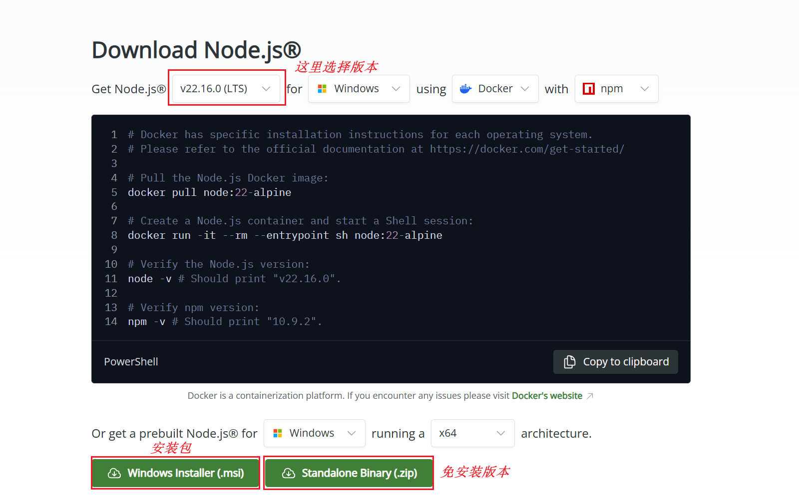

下载完毕后我们会得到这样一个压缩包：

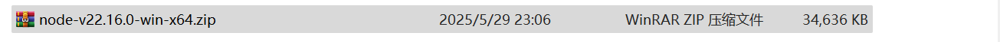

## <font size=3>3. 解压安装</font>

上面下载的是免安装版本，所以直接解压就可以了：


然后我们新建 node_cache 和 node_global 目录：

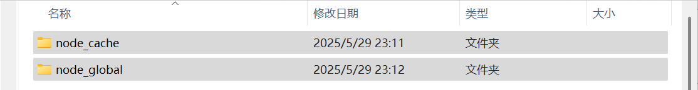

## <font size=3>4. 环境变量</font>

### <font size=3>4.1 【SYSTEM】—— NODE_HOME</font>

新增一个 NODE_HOME 环境变量，【右键此电脑】&rarr;【属性】&rarr;【高级系统设置】&rarr;【高级】&rarr;【环境变量】

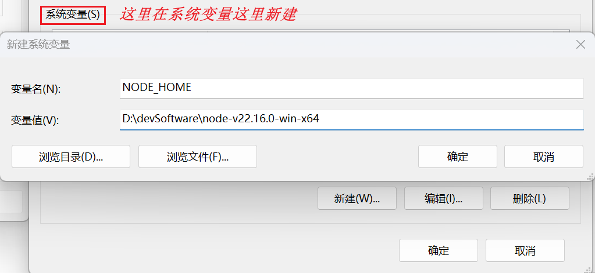

然后我们可以打开文件资源管理器，在地址栏输入 %NODE_HOME% ，然后回车，如果添加没问题的话，应该就可以打node的安装目录了：

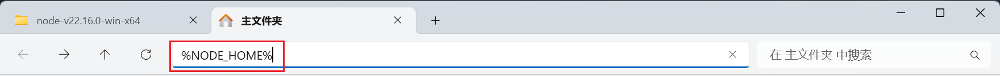

### <font size=3>4.2 【USER】—— Path</font>

和上面一样的步骤：【右键此电脑】&rarr;【属性】&rarr;【高级系统设置】&rarr;【高级】&rarr;【环境变量】，这次我们在用户变量的Path中添加以下三个路径：

```shell
%NODE_HOME%
%NODE_HOME%\node_global
%NODE_HOME%\node_cache
```

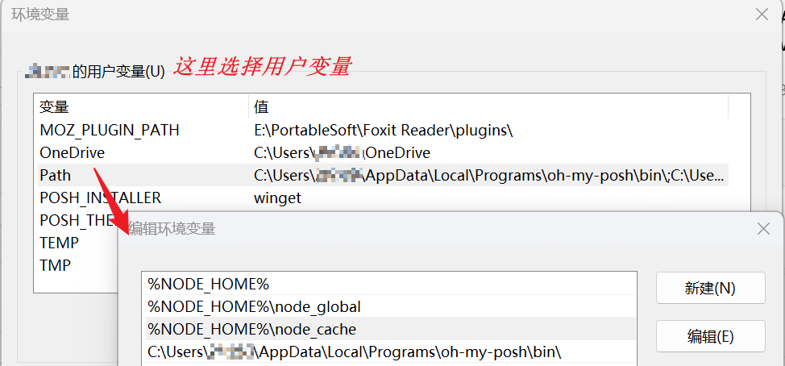

### <font size=3>4.3 验证是否生效</font>

上面环境变量配置完毕后，【win+r】&rarr;【cmd】打开命令行，我们输入以下命令查看node和npm是否可用：

```shell
node -v
npm -v
```

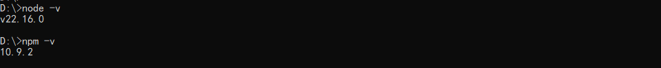

能打印出版本说明安装成功，后续可以正常使用。如果是powershell的话，可能会出现下面的问题：

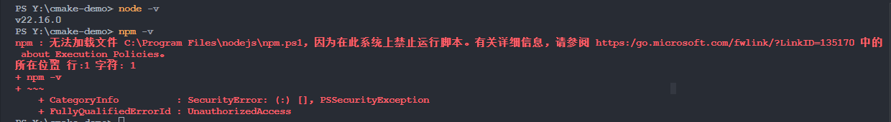

这通常意味着 Windows 的执行策略设置为禁止运行 PowerShell脚本。默认情况下，Windows 可能出于安全考虑，限制了脚本的执行。可以以管理员身份运行powershell，然后执行以下命令：

```shell
Set-ExecutionPolicy RemoteSigned
```

这个命令会将执行策略设置为允许运行本地脚本和远程签名的脚本，但阻止未签名的本地脚本。

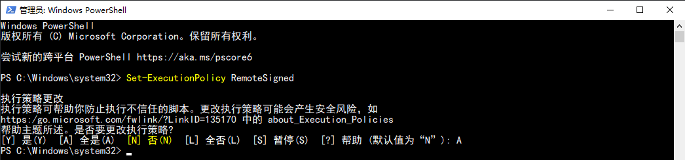

然后重新执行就可以了：

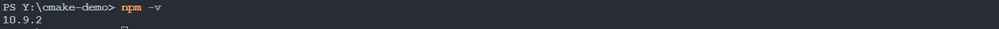

## <font size=3>5. 配置node</font>

### <font size=3>5.1 修改目录</font>

npm的缓存目录和全局目录默认是在C盘的 %APPDATA%下，后续的缓存以及一些插件，都会安装在这里，我们配置一下，把插件安装到其他目录去，我们在cmd命令行执行：

```shell
npm config set prefix "D:\devSoftware\node-v22.16.0-win-x64\node_global"
npm config set cache "D:\devSoftware\node-v22.16.0-win-x64\node_cache"
```

就是我们刚才新建的两个目录。然后可以通过下面的命令查看配置：

```shell
npm list -g
```

我们可以看一下这个文件 `%USER%\.npmrc`：

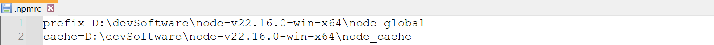

会发现这里出现了两项配置。

### <font size=3>5.2 验证是否生效</font>

我们可以全局安装vsce：

```shell
npm i vsce -g
```


然后我们再看一下 node_global 和node_cache目录：

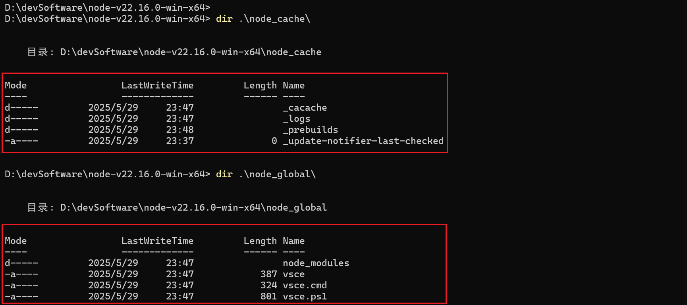

# <font size=3>四、参考资料</font>

## <font size=3>1. 怎么开始？</font>

vscode官网已经我为我们提供了扩展API相关的文档：[Extension API | Visual Studio Code Extension API](https://code.visualstudio.com/api)。还有一份中文的文档资料：[扩展 API | Visual Studio Code 扩展 API - VSCode 编辑器](https://vscode.js.cn/api)，这里的demo都在这里：[microsoft/vscode-extension-samples: Sample code illustrating the VS Code extension API.](https://github.com/microsoft/vscode-extension-samples)

## <font size=3>2. 什么语言开发？</font>

这个我们可以看一下官方提供的扩展的demo：[vscode-extension-samples/helloworld-sample/src/extension.ts](https://github.com/microsoft/vscode-extension-samples/blob/main/helloworld-sample/src/extension.ts)

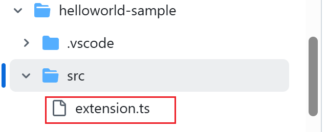

这里的ts就是**TypeScript**。TypeScript 是由微软开发的一种编程语言，它是 JavaScript 的超集，这意味着它包含了 JavaScript 的所有功能，并在此基础上添加了新的特性和工具。TypeScript 的设计目标是帮助开发者构建大型应用程序，并且它的代码最终会被编译成纯 JavaScript，使得编译后的代码可以在任何浏览器、任何计算机和任何操作系统上运行。


 TypeScript 使用的编译器是 `tsc`。我们需要全局或在工作区中安装 TypeScript 编译器，以便将 TypeScript 源代码转译为 JavaScript (`tsc HelloWorld.ts`)。

```shell
npm install -g typescript         # 全局安装
npm install --save-dev typescript # 本地安装，可以避免与我们可能拥有的其他 TypeScript 项目发生潜在冲突。
tsc --version
```

官网有一部分说明文档：[Visual Studio Code 中的 TypeScript - VSCode 编辑器](https://vscode.js.cn/docs/languages/typescript)

## <font size=3>3. 其他参考资料</font>

- [知乎vscode插件修改和重新编译 - 赵青青 - 博客园](https://www.cnblogs.com/zhaoqingqing/p/14823179.html)

- [VSCode插件开发全攻略（一）概览 - 我是小茗同学 - 博客园](https://www.cnblogs.com/liuxianan/p/vscode-plugin-overview.html)

- [VS Code 插件开发中文文档](https://rackar.github.io/vscode-ext-doccn/)

> 参考资料：
>
> [windows安装npm教程_npm 安装-CSDN博客](https://blog.csdn.net/zhouyan8603/article/details/109039732)
>
> [Node.js安装及环境配置超详细教程【Windows系统】_windows 安装nodejs-CSDN博客](https://blog.csdn.net/Nicolecocol/article/details/136788200)
>
> [Extension API | Visual Studio Code Extension API](https://code.visualstudio.com/api)
>
> [知乎vscode插件修改和重新编译 - 赵青青 - 博客园](https://www.cnblogs.com/zhaoqingqing/p/14823179.html)
>
> [VSCode插件开发全攻略（一）概览 - 我是小茗同学 - 博客园](https://www.cnblogs.com/liuxianan/p/vscode-plugin-overview.html)