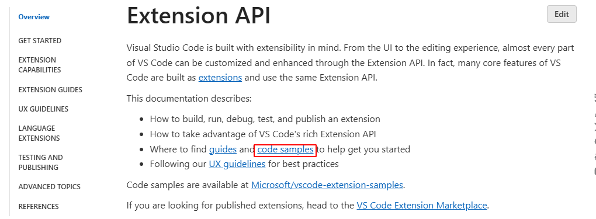
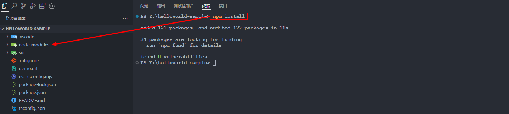
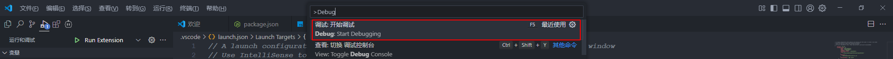
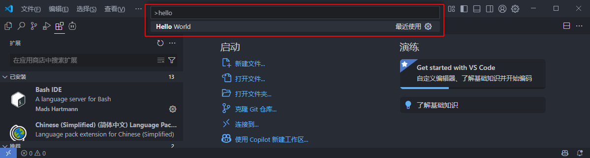
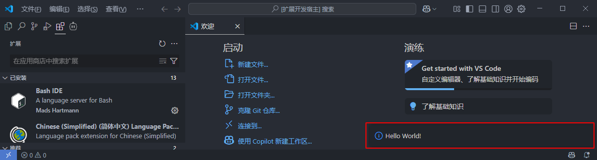
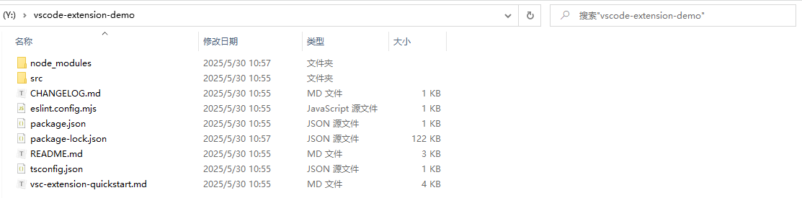
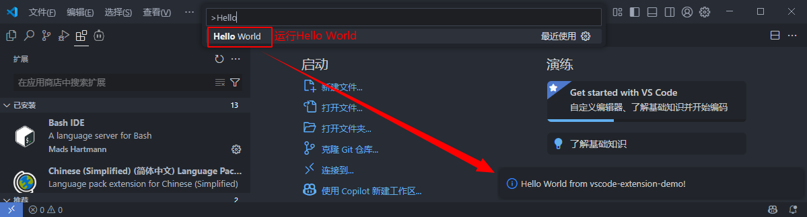
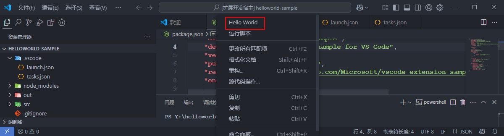
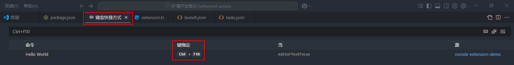

# <font size=3>一、vscode官方demo</font>

先用vscode官方提供的demo了解一下扩展的基本结构。

## <font size=3>1. demo在哪里？</font>

去哪里找vscode提供的demo？在官网 [Extension API | Visual Studio Code Extension API](https://code.visualstudio.com/api) 这里是有说明的：



直接点这里就可以跳转到 [GitHub - microsoft/vscode-extension-samples](https://github.com/microsoft/vscode-extension-samples)，这个仓库中就是官网提供的所有demo，我们下载完毕后，找到这个 [vscode-extension-samples/helloworld-sample](https://github.com/microsoft/vscode-extension-samples/tree/main/helloworld-sample)，它包含以下文件：

```shell
.
+--- .gitignore
+--- .vscode
|   +--- launch.json
|   +--- tasks.json
+--- demo.gif
+--- eslint.config.mjs
+--- package-lock.json
+--- package.json
+--- README.md
+--- src
|   +--- extension.ts
+--- tsconfig.json
```

## <font size=3>2. 项目结构</font>

### <font size=3>2.1 `src/extension.ts`</font>

```json
// The module 'vscode' contains the VS Code extensibility API
// Import the module and reference it with the alias vscode in your code below
import * as vscode from 'vscode';

// this method is called when your extension is activated
// your extension is activated the very first time the command is executed
export function activate(context: vscode.ExtensionContext) {
	// Use the console to output diagnostic information (console.log) and errors (console.error)
	// This line of code will only be executed once when your extension is activated
	console.log('Congratulations, your extension "helloworld-sample" is now active!');

	// The command has been defined in the package.json file
	// Now provide the implementation of the command with registerCommand
	// The commandId parameter must match the command field in package.json
	const disposable = vscode.commands.registerCommand('extension.helloWorld', () => {
		// The code you place here will be executed every time your command is executed

		// Display a message box to the user
		vscode.window.showInformationMessage('Hello World!');
	});

	context.subscriptions.push(disposable);
}
```

这个具体的先不看，知道它会被编译成对应的js文件，然后打印一个Hello World!就可以了。

### <font size=3>2.2 `package.json`</font>

```json
{
    //......
	// 扩展的激活事件
	"activationEvents": [],
    // 入口文件
	"main": "./out/extension.js",
    // 贡献点，vscode插件大部分功能配置都在这里
	"contributes": {
		"commands": [
			{
				"command": "extension.helloWorld",
				"title": "Hello World"
			}
		]
	},
	//......
}
```

- `main`定义了整个插件的主入口；
- 我们在`contributes.commands`里面注册了一个名为`extension.sayHello`的命令，并在`out/extension.js`中去实现了它（弹出一个`Hello World`的提示）。
- `title`这个定义了我们在命令行调用的时候的命令名称，我们后面运行调试的时候会使用`Ctrl+shift+P`打开命令框来运行命令，搜索这个`Hello World`就可以调用这个插件。

### <font size=3>2.3 `.vscode`</font>

这个目录下有两个文件：

```shell
+--- .vscode
|   +--- launch.json
|   +--- tasks.json
```

- launch.json 是用于设置调试器的启动配置。具体的可以看这里：[Debug code with Visual Studio Code](https://code.visualstudio.com/docs/debugtest/debugging#_launch-versus-attach-configurations)
- tasks.json 是用来配置任务运行的文件。具体可以看这里：[Integrate with External Tools via Tasks](https://code.visualstudio.com/docs/debugtest/tasks)

## <font size=3>3. 安装所需模块</font>

在调试之前，我们需要先安装模块，进入helloworld-sample目录，执行：

```shell
npm install
```



安装完成后，会在工程目录下生成node_modules目录，里面就存放着工程所需的模块。

## <font size=3>4. 运行调试</font>

在编辑器中，打开`src/extension.ts`并按`F5`或【Ctrl+Shift+P】&rarr;【Debug：Start Debuging】。这将在一个新的【扩展开发主机窗口】中编译和运行扩展。

> Tips：这个新窗口已经加载了我们的插件，窗口标题会注明【扩展开发主机】。



我们在【新窗口】中按下 Ctrl+Shift+P，并输入`hello world`：



就会在右下角弹出如下窗口：



# <font size=3>二、自己的工程</font>

自己创建扩展工程需要通过微软的[GitHub - microsoft/vscode-generator-code](https://github.com/Microsoft/vscode-generator-code)脚手架来生成项目结构。可以参考这里：[Your First Extension | Visual Studio Code Extension API](https://code.visualstudio.com/api/get-started/your-first-extension)

## <font size=3>1. Generator安装</font>

通过一下命令安装所需工具：

```shell
npm install -g yo generator-code
```


## <font size=3>2. TypeScript 工程</font>

我们执行以下命令：

```shell
yo code
```

然后会有一堆的交互提示，按照官网的说明填写就可以了，我这里修改了demo名称：

```shell
PS Y:\> yo code

     _-----_     ╭──────────────────────────╮
    |       |    │   Welcome to the Visual  │
    |--(o)--|    │   Studio Code Extension  │
   `---------´   │        generator!        │
    ( _´U`_ )    ╰──────────────────────────╯
    /___A___\   /
     |  ~  |     
   __'.___.'__   
 ´   `  |° ´ Y ` 

? What type of extension do you want to create? New Extension (TypeScript)
? What's the name of your extension? vscode-extension-demo
? What's the identifier of your extension? vscode-extension-demo
? What's the description of your extension? This is vscode-extension-demo!
? Initialize a git repository? Yes      
? Which bundler to use? unbundled
? Which package manager to use? npm
# 中间就是安装一些模块相关的东西...
? Do you want to open the new folder with Visual Studio Code? (Use arrow keys)
❯ Open with `code`
  Skip
```

然后我们就会得到这样一个目录：



这就是我们创建的工程啦。

> Tips：在 Initialize a git repository? 这一步会自动初始化一个git仓库，看个人需求。

## <font size=3>3. 项目结构</font>

这个创建出来的工程和前面是一样的，我们主要分析一下怎么运行，将会打印什么。

### <font size=3>3.1 `src/extension.ts`</font>

```json
// The module 'vscode' contains the VS Code extensibility API
// Import the module and reference it with the alias vscode in your code below
import * as vscode from 'vscode';

// This method is called when your extension is activated
// Your extension is activated the very first time the command is executed
export function activate(context: vscode.ExtensionContext) {
		//......
		// Display a message box to the user
		vscode.window.showInformationMessage('Hello World from vscode-extension-demo!');
	});

	context.subscriptions.push(disposable);
}

// This method is called when your extension is deactivated
export function deactivate() {}

```

这里将会给出弹窗，然后打印 `Hello World from vscode-extension-demo!`。

### <font size=3>3.2 `package.json`</font>

```json
{
	//......
    "main": "./out/extension.js",
    "contributes": {
        "commands": [
            {
                "command": "vscode-extension-demo.helloWorld",
                "title": "Hello World"
            }
        ]
    },
	//......
}
```

我们在`contributes.commands`里面注册了一个名为`vscode-extension-demo.helloWorld`的命令，标题还是叫`Hello World`，这意味着我们在调试的时候还是输入这个命令，并在`out/extension.js`中去实现了它。

## <font size=3>4. 运行调试</font>

和前面一样，在编辑器中，打开`src/extension.ts`并按`F5`或【Ctrl+Shift+P】&rarr;【Debug：Start Debuging】。然后在新的编辑器中【Ctrl+Shift+P】&rarr;【Hello World】



# <font size=3>三、右键菜单</font>

可以参考：[Wrapping Up | Visual Studio Code Extension API](https://code.visualstudio.com/api/get-started/wrapping-up#issue-reporting)和[Contribution Points | Visual Studio Code Extension API](https://code.visualstudio.com/api/references/contribution-points#contributesmenus)

## <font size=3>1.  `package.json`</font>

在 `package.json`中添加以下内容：

```json
{
	//......
	"contributes": {
		"commands": [
			{
				"command": "vscode-extension-demo.helloWorld",
				"title": "Hello World"
			}
		],
		"menus": {
			"editor/context": [
				{
					"command": "vscode-extension-demo.helloWorld",
					"group": "navigation",
					"when": "editorTextFocus"
				}
			]
		}
	},
	//......
}
```

## <font size=3>2. 显示效果</font>



# <font size=3>四、快捷键绑定</font>

我要是想定义一个快捷键调用这个HelloWorld呢？参考这里：[Contribution Points | Visual Studio Code Extension API](https://code.visualstudio.com/api/references/contribution-points#contributeskeybindings)

## <font size=3>1. 一般格式</font>

```json
{
  "contributes": {
    "keybindings": [
      {
        "command": "extension.sayHello",
        "key": "ctrl+f1",
        "mac": "cmd+f1",
        "when": "editorTextFocus"
      }
    ]
  }
}
```

## <font size=3>2. `package.json`</font>

```json
{
    //......
	"contributes": {
		//......
		"keybindings": [
            {
                "command": "vscode-extension-demo.helloWorld",
                "key": "ctrl+f10",
                "mac": "cmd+f10",
                "when": "editorTextFocus"
            }
        ],
		//......
	},
}
```

## <font size=3>3. 绑定结果</font>

