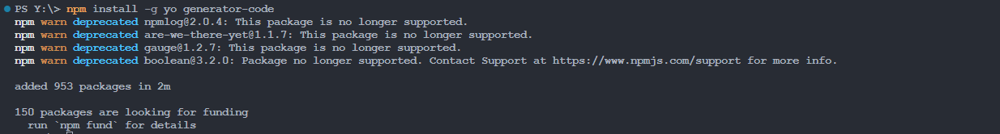
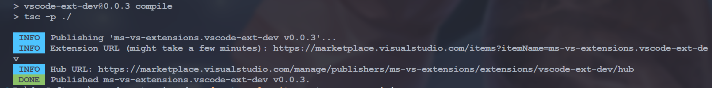

# <font size=3>一、vscode官方demo</font>

先用vscode官方提供的demo了解一下扩展的基本结构。

## <font size=3>1. demo在哪里？</font>

去哪里找vscode提供的demo？在官网 [Extension API | Visual Studio Code Extension API](https://code.visualstudio.com/api) 这里是有说明的：


直接点这里就可以跳转到 [GitHub - microsoft/vscode-extension-samples](https://github.com/microsoft/vscode-extension-samples)，这个仓库中就是官网提供的所有demo，我们下载完毕后，找到这个 [vscode-extension-samples/helloworld-sample](https://github.com/microsoft/vscode-extension-samples/tree/main/helloworld-sample)，它包含以下文件：

```shell
.
+--- .gitignore
+--- .vscode
|   +--- launch.json
|   +--- tasks.json
+--- demo.gif
+--- eslint.config.mjs
+--- package-lock.json
+--- package.json
+--- README.md
+--- src
|   +--- extension.ts
+--- tsconfig.json
```

## <font size=3>2. 项目结构</font>

### <font size=3>2.1 `src/extension.ts`</font>

```json
// The module 'vscode' contains the VS Code extensibility API
// Import the module and reference it with the alias vscode in your code below
import * as vscode from 'vscode';

// this method is called when your extension is activated
// your extension is activated the very first time the command is executed
export function activate(context: vscode.ExtensionContext) {
	// Use the console to output diagnostic information (console.log) and errors (console.error)
	// This line of code will only be executed once when your extension is activated
	console.log('Congratulations, your extension "helloworld-sample" is now active!');

	// The command has been defined in the package.json file
	// Now provide the implementation of the command with registerCommand
	// The commandId parameter must match the command field in package.json
	const disposable = vscode.commands.registerCommand('extension.helloWorld', () => {
		// The code you place here will be executed every time your command is executed

		// Display a message box to the user
		vscode.window.showInformationMessage('Hello World!');
	});

	context.subscriptions.push(disposable);
}
```

这个具体的先不看，知道它会被编译成对应的js文件，然后打印一个Hello World!就可以了。

### <font size=3>2.2 `package.json`</font>

```json
{
    //......
	// 扩展的激活事件
	"activationEvents": [],
    // 入口文件
	"main": "./out/extension.js",
    // 贡献点，vscode插件大部分功能配置都在这里
	"contributes": {
		"commands": [
			{
				"command": "extension.helloWorld",
				"title": "Hello World"
			}
		]
	},
	//......
}
```

- `main`定义了整个插件的主入口；
- 我们在`contributes.commands`里面注册了一个名为`extension.sayHello`的命令，并在`out/extension.js`中去实现了它（弹出一个`Hello World`的提示）。
- `title`这个定义了我们在命令行调用的时候的命令名称，我们后面运行调试的时候会使用`Ctrl+shift+P`打开命令框来运行命令，搜索这个`Hello World`就可以调用这个插件。

### <font size=3>2.3 `.vscode`</font>

这个目录下有两个文件：

```shell
+--- .vscode
|   +--- launch.json
|   +--- tasks.json
```

- launch.json 是用于设置调试器的启动配置。具体的可以看这里：[Debug code with Visual Studio Code](https://code.visualstudio.com/docs/debugtest/debugging#_launch-versus-attach-configurations)
- tasks.json 是用来配置任务运行的文件。具体可以看这里：[Integrate with External Tools via Tasks](https://code.visualstudio.com/docs/debugtest/tasks)

## <font size=3>3. 安装所需模块</font>

在调试之前，我们需要先安装模块，进入helloworld-sample目录，执行：

```shell
npm install
```


安装完成后，会在工程目录下生成node_modules目录，里面就存放着工程所需的模块。

## <font size=3>4. 运行调试</font>

在编辑器中，打开`src/extension.ts`并按`F5`或【Ctrl+Shift+P】&rarr;【Debug：Start Debuging】。这将在一个新的【扩展开发主机窗口】中编译和运行扩展。

> Tips：这个新窗口已经加载了我们的插件，窗口标题会注明【扩展开发主机】。


我们在【新窗口】中按下 Ctrl+Shift+P，并输入`hello world`：


就会在右下角弹出如下窗口：


# <font size=3>二、自己的工程</font>

自己创建扩展工程需要通过微软的[GitHub - microsoft/vscode-generator-code](https://github.com/Microsoft/vscode-generator-code)脚手架来生成项目结构。可以参考这里：[Your First Extension | Visual Studio Code Extension API](https://code.visualstudio.com/api/get-started/your-first-extension)

## <font size=3>1. Generator安装</font>

通过一下命令安装所需工具：

```shell
npm install -g yo generator-code
```



## <font size=3>2. TypeScript 工程</font>

我们执行以下命令：

```shell
yo code
```

然后会有一堆的交互提示，按照官网的说明填写就可以了，我这里修改了demo名称：

```shell
PS Y:\> yo code

     _-----_     ╭──────────────────────────╮
    |       |    │   Welcome to the Visual  │
    |--(o)--|    │   Studio Code Extension  │
   `---------´   │        generator!        │
    ( _´U`_ )    ╰──────────────────────────╯
    /___A___\   /
     |  ~  |     
   __'.___.'__   
 ´   `  |° ´ Y ` 

? What type of extension do you want to create? New Extension (TypeScript)
? What's the name of your extension? vscode-extension-demo
? What's the identifier of your extension? vscode-extension-demo
? What's the description of your extension? This is vscode-extension-demo!
? Initialize a git repository? Yes      
? Which bundler to use? unbundled
? Which package manager to use? npm
# 中间就是安装一些模块相关的东西...
? Do you want to open the new folder with Visual Studio Code? (Use arrow keys)
❯ Open with `code`
  Skip
```

然后我们就会得到这样一个目录：


这就是我们创建的工程啦。

> Tips：在 Initialize a git repository? 这一步会自动初始化一个git仓库，看个人需求。

## <font size=3>3. 项目结构</font>

这个创建出来的工程和前面是一样的，我们主要分析一下怎么运行，将会打印什么。

### <font size=3>3.1 `src/extension.ts`</font>

```json
// The module 'vscode' contains the VS Code extensibility API
// Import the module and reference it with the alias vscode in your code below
import * as vscode from 'vscode';

// This method is called when your extension is activated
// Your extension is activated the very first time the command is executed
export function activate(context: vscode.ExtensionContext) {
		//......
		// Display a message box to the user
		vscode.window.showInformationMessage('Hello World from vscode-extension-demo!');
	});

	context.subscriptions.push(disposable);
}

// This method is called when your extension is deactivated
export function deactivate() {}

```

这里将会给出弹窗，然后打印 `Hello World from vscode-extension-demo!`。

### <font size=3>3.2 `package.json`</font>

```json
{
	//......
    "main": "./out/extension.js",
    "contributes": {
        "commands": [
            {
                "command": "vscode-extension-demo.helloWorld",
                "title": "Hello World"
            }
        ]
    },
	//......
}
```

我们在`contributes.commands`里面注册了一个名为`vscode-extension-demo.helloWorld`的命令，标题还是叫`Hello World`，这意味着我们在调试的时候还是输入这个命令，并在`out/extension.js`中去实现了它。

## <font size=3>4. 运行调试</font>

和前面一样，在编辑器中，打开`src/extension.ts`并按`F5`或【Ctrl+Shift+P】&rarr;【Debug：Start Debuging】。然后在新的编辑器中【Ctrl+Shift+P】&rarr;【Hello World】


# <font size=3>三、Hello world优化</font>

## <font size=3>1. 右键菜单</font>

可以参考：[Wrapping Up | Visual Studio Code Extension API](https://code.visualstudio.com/api/get-started/wrapping-up#issue-reporting)和[Contribution Points | Visual Studio Code Extension API](https://code.visualstudio.com/api/references/contribution-points#contributesmenus)

### <font size=3>1.1  `package.json`</font>

在 `package.json`中添加以下内容：

```json
{
	//......
	"contributes": {
		"commands": [
			{
				"command": "vscode-extension-demo.helloWorld",
				"title": "Hello World"
			}
		],
		"menus": {
			"editor/context": [
				{
					"command": "vscode-extension-demo.helloWorld",
					"group": "navigation",
					"when": "editorTextFocus"
				}
			]
		}
	},
	//......
}
```

### <font size=3>1.2 显示效果</font>


## <font size=3>2. 快捷键绑定</font>

我要是想定义一个快捷键调用这个HelloWorld呢？参考这里：[Contribution Points | Visual Studio Code Extension API](https://code.visualstudio.com/api/references/contribution-points#contributeskeybindings)

### <font size=3>2.1 一般格式</font>

```json
{
  "contributes": {
    "keybindings": [
      {
        "command": "extension.sayHello",
        "key": "ctrl+f1",
        "mac": "cmd+f1",
        "when": "editorTextFocus"
      }
    ]
  }
}
```

### <font size=3>2.2 `package.json`</font>

```json
{
    //......
	"contributes": {
		//......
		"keybindings": [
            {
                "command": "vscode-extension-demo.helloWorld",
                "key": "ctrl+f10",
                "mac": "cmd+f10",
                "when": "editorTextFocus"
            }
        ],
		//......
	},
}
```

### <font size=3>2.3 绑定结果</font>


## <font size=3>3. 下方状态栏</font>

- [Status Bar | Visual Studio Code Extension API](https://code.visualstudio.com/api/ux-guidelines/status-bar)
- [状态栏 | Visual Studio Code 扩展 API - VSCode 编辑器](https://vscode.js.cn/api/ux-guidelines/status-bar)。

- 官方demo：[vscode-extension-samples/statusbar-sample at main · microsoft/vscode-extension-samples](https://github.com/microsoft/vscode-extension-samples/tree/main/statusbar-sample)

### <font size=3>3.1 API属性</font>

具体的属性可以看这里：[StatusBarItem](https://vscode.js.cn/api/references/vscode-api#StatusBarItem)，还可以为状态栏添加一些内置的图标，可以参考这里：[产品图标参考 | Visual Studio Code 扩展 API - VSCode 编辑器](https://vscode.js.cn/api/references/icons-in-labels)

### <font size=3>3.2 demo实例</font>

在前面的基础上添加：

```typescript
	// 在 VS Code 界面中创建一个状态栏项
	// 参数说明：
	// - vscode.StatusBarAlignment.Left: 将项目放置在状态栏的左侧
	// - 100: 优先级值（数字越大，项目位置越靠左）
	const statusBarItem = vscode.window.createStatusBarItem(vscode.StatusBarAlignment.Left, 100);
	
	// 设置状态栏中显示的文本
	// $(rocket) 是一个 codicon（VS Code 图标），在文本前显示一个火箭图标
	// 你可以使用不同的图标，如 $(heart)、$(star)、$(check) 等
	statusBarItem.text = "$(rocket) Hello World";
	
	// 设置鼠标悬停在状态栏项上时显示的提示文本
	// 这有助于用户理解该项的功能
	statusBarItem.tooltip = "点击运行 Hello World 命令";
	
	// 将状态栏项与命令关联
	// 当用户点击状态栏项时，将执行此命令
	// 命令 ID 必须与 package.json 中定义的一致
	statusBarItem.command = 'vscode-extension-demo.helloWorld';
	
	// 使状态栏项在 UI 中可见
	// 没有这个调用，项目将被创建但不会显示
	statusBarItem.show();

	// 将命令和状态栏项都添加到扩展上下文的订阅中
	// 这确保它们在扩展被停用时正确处理
	// 正确的处理可以防止内存泄漏并确保扩展干净地关闭
	context.subscriptions.push(disposable, statusBarItem);
```

### <font size=3>3.3 显示效果</font>


## <font size=3>4. 激活事件</font>

可以参考：[激活事件 | Visual Studio Code 扩展 API - VSCode 编辑器](https://vscode.js.cn/api/references/activation-events)

### <font size=3>4.1 出现的问题</font>

上面的扩展在只有右键菜单和命令行运行时没有什么说的，但是添加了状态栏之后，会发现运行后，状态栏是不显示的，只有当扩展命令运行一次后，状态栏才会显示出Hello World的标签，这是为什么？

原因就是扩展在`VS Code`中默认是没有被激活的，所以不会出现状态栏。

### <font size=3>4.2 activationEvents</font>

**激活事件**是一组 JSON 声明，需要在在 `package.json` [扩展清单](https://vscode.js.cn/api/references/extension-manifest)的 `activationEvents` 字段中进行这些声明。当**激活事件**发生时，我们的扩展就会被激活。常用的有以下配置：

```txt
onLanguage:$
onCommand:$
onDebug
workspaceContains:$
onFileSystem:$
onView:$
onUri
*
```

这里以[onLanguage](https://vscode.js.cn/api/references/activation-events#onLanguage)为例，当配置如下：

```json
"activationEvents": [
    "onLanguage:python"，
    "onLanguage:typescript"
]
```

当我打开python和typescript文件时，扩展就会被激活。再来说一下`*`，如果配置了`*`，只要一启动vscode，插件就会被激活，为了出色的用户体验，官方不推荐这么做。

## <font size=3>5. package.json文件</font>

这里就不详细说了，看这里即可：[扩展清单 | Visual Studio Code 扩展 API - VSCode 编辑器](https://vscode.js.cn/api/references/extension-manifest)

# <font size=3>三、打包与发布</font>

## <font size=3>1. 打包工具vsce </font>

无论是本地打包还是发布到应用市场都需要借助`vsce`这个工具，[vsce](https://github.com/microsoft/vscode-vsce) 是“Visual Studio Code Extensions”的缩写，它是一个用于打包、发布和管理 VS Code 扩展的命令行工具。通过以下命令安装：

```shell
npm i vsce -g    # 全局安装vsce
vsce --version   # 安装完毕后可以查看是否安装成功
```

## <font size=3>2. 打包成vsix文件</font>

进入扩展的工程目录，然后执行：

```shell
vsce package
```

然后就发现报错了：


这个是因为生成工程后没有修改过README.md文件，做一点修改就可以了。然后重新打包，又有警告：


这个是因为package.json中没有设置repository。然后我们重新执行即可，整体会有以下信息：

```shell
D:\devSoftware\vscode-extension-demo [master ↑2]> vsce package
Executing prepublish script 'npm run vscode:prepublish'...

> vscode-extension-demo@0.0.1 vscode:prepublish
> npm run compile


> vscode-extension-demo@0.0.1 compile
> tsc -p ./

 WARNING  Using '*' activation is usually a bad idea as it impacts performance.
More info: https://code.visualstudio.com/api/references/activation-events#Start-up
Do you want to continue? [y/N] y
 DONE  Packaged: D:\devSoftware\vscode-extension-demo\vscode-extension-demo-0.0.1.vsix (8 files, 5.57KB)
```

中间的警告可以不管，是因为激活插件的事件设置为启动vscode了，任何情况下都直接启动了。然后就可以看到当前目录下生成了vsix文件：


这个文件我们就可以像正常的插件一样安装了。

## <font size=3>3. 发布到应用市场</font>

我们可以注册开发者账号，发布到官网应用市场，这个发布和npm一样是不需要审核的。这部分可以参考：[发布扩展 | Visual Studio Code 扩展 API - VSCode 编辑器](https://vscode.js.cn/api/working-with-extensions/publishing-extension#publishing-extensions)

> Tips：Visual Studio Code的应用市场基于微软自己的`Azure DevOps`，插件的身份验证、托管和管理都是在这里。
>
> - 一个Microsoft账号可以创建多个`Azure`组织；
> - 一个组织可以创建多个`publisher`账号；
> - 同时一个组织可以创建多个`PAT`（`Personal Access Token`，个人访问令牌）；

### <font size=3>3.1 注册账号</font>

（1）注册一个微软账号：[https://login.live.com/](https://login.live.com/)，没有的话注册一个，有的话直接登录。

（2）访问[https://aka.ms/SignupAzureDevOps](https://aka.ms/SignupAzureDevOps) ，如果从来没有使用过Azure，那么会看到如下提示：


点这里的Continue，然后就会创建一个以邮箱前缀为名的组织。

### <font size=3>3.2 创建令牌</font>

（3）打开个人资料图片旁边的用户设置下拉菜单，然后选择 **个人访问令牌**（Personal access tokens）。第一次进来的时候会看到一个创建项目的提示，可以不用管。


（4）在**个人访问令牌**页面上，选择**新建令牌**（New Token）。

（5）在创建新个人访问令牌模态框中，为令牌选择以下详细信息

- 名称：您为令牌指定的任何名称

- 组织：**所有可访问的组织**（All accessible organizations）

- 过期（可选）：设置令牌的期望过期日期

- 范围：自定义定义（Custom defined）。点击**范围**（Scopes）部分下方的**显示所有范围**（Show all scopes）链接，在范围列表中，滚动到 **Marketplace** 并选择 **管理**（Manage）范围


> Tips：这里特别要注意`Organization`要选择`all accessible organizations`，`Scopes`要选择`Full access`，否则后面发布会失败。可能会报：
>
> ```shell
>  ERROR  Failed request: (401)
> ```

当创建令牌成功后，需要本地记下来，因为网站是不会帮我们保存的。

### <font size=3>3.3 创建发布者</font> 

**发布者**是可以在 Visual Studio Code 市场上发布扩展的身份。每个扩展都需要在其[`package.json` 文件](https://vscode.js.cn/api/references/extension-manifest)中包含一个 `publisher` 标识符。

（1）转到[Visual Studio 市场发布者管理页面](https://marketplace.visualstudio.com/manage)。

（2）使用在上一节中用于创建[个人访问令牌](https://vscode.js.cn/api/working-with-extensions/publishing-extension#get-a-personal-access-token)的同一个 Microsoft 帐户登录。

（3）点击左侧窗格中的**创建发布者**（Create publisher）。

（4）在新页面中，指定新发布者的必需参数 - 标识符和名称（分别为 **ID** 和 **Name** 字段）

- **ID**：我们在市场上的发布者的**唯一**标识符，将用于我们的扩展 URL 中。ID 创建后无法更改。

- **Name**：我们发布者的**唯一**名称，将在市场中与我们的扩展一起显示。这可以是我们的公司或品牌名称。

以下是 Docker 扩展的发布者标识符和名称示例


（5）（可选）填写其余字段。

（6）点击**创建**（Create）

### <font size=3>3.4 本地登录</font>

在本地使用 `vsce` 验证新创建的发布者。在我们的终端中运行以下命令，当提示时，输入上一步中创建的个人访问令牌。

```shell
vsce login <publisher id>

https://marketplace.visualstudio.com/manage/publishers/
Personal Access Token for publisher '<publisher id>': ****************************************************

The Personal Access Token verification succeeded for the publisher '<publisher id>'.

```


### <font size=3>3.5 发布扩展</font>

可以通过两种方式发布扩展：

- （1）自动方式，使用 `vsce publish` 命令

```shell
vsce publish -p ****************************************************
```

如果尚未通过上面的 `vsce login` 命令提供您的个人访问令牌，`vsce` 将会提示您输入。

- （2）手动方式，使用 `vsce package` 将扩展打包成可安装的 VSIX 格式，然后将其上传到[Visual Studio 市场发布者管理页面](https://marketplace.visualstudio.com/manage)。


### <font size=3>3.6 发布验证</font>

若是发布成功，会有如下提示：



我们也可以打开[Visual Studio 市场发布者管理页面](https://marketplace.visualstudio.com/manage)：


然后过几分钟就可以在这里找到我们发布的扩展啦：

```shell
https://marketplace.visualstudio.com/items?itemName=<extension_id>.<extension_name>
```

在这里就是：https://marketplace.visualstudio.com/items?itemName=ms-vs-extensions.vscode-ext-dev


## <font size=3>4. 增量发布</font>

版本号格式一般是`major.minor.patch`，如果想让发布之后版本号的patch自增，例如：`0.0.1` &rarr; `0.0.2`，可以这样：

```shell
vsce publish patch
```

执行这个命令后会自动修改`package.json`里面的版本号。同理，`vsce publish minor`也是可以的。

## <font size=3>5. 取消发布</font>

```shell
vsce unpublish (publisher name).(extension name)
```
