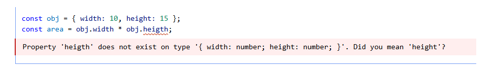
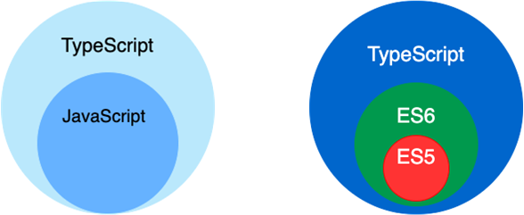
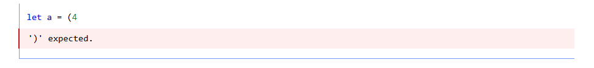
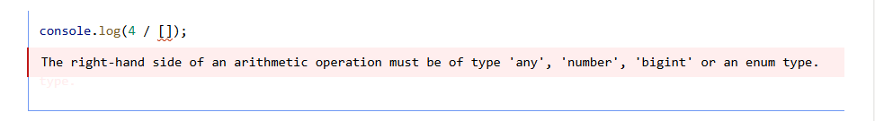

# <font size=3>一、JavaScript</font>

>[JavaScript 教程-JavaScript中文网-JavaScript教程资源分享门户](https://www.javascriptcn.com/js)
>
>[什么是 JavaScript？ - 学习 Web 开发 | MDN](https://developer.mozilla.org/zh-CN/docs/Learn_web_development/Core/Scripting/What_is_JavaScript)


## <font size=3>1. 什么是JavaScript？</font>

JavaScript 是一种脚本编程语言，它可以在网页上实现复杂的功能，网页展现给你的不再是简单的静态信息，而是实时的内容更新——交互式的地图、2D/3D 动画、滚动播放的视频等等——JavaScript 就在其中。它是标准 Web 技术蛋糕的第三层:


- [HTML](https://developer.mozilla.org/zh-CN/docs/Glossary/HTML) 定义了网页的内容。是一种标记语言，用来结构化我们的网页内容并赋予内容含义，例如定义段落、标题和数据表，或在页面中嵌入图片和视频。
- [CSS](https://developer.mozilla.org/zh-CN/docs/Glossary/CSS) 描述了网页的布局。是一种样式规则语言，可将样式应用于 HTML 内容，例如设置背景颜色和字体，在多个列中布局内容。
- [JavaScript](https://developer.mozilla.org/zh-CN/docs/Glossary/JavaScript) 控制了网页的行为。是一种脚本语言，可以用来创建动态更新的内容，控制多媒体，制作图像动画等。

## <font size=3>2. 怎么运行？</font>

可以嵌入html执行，也可以通过node命令运行：

```shell
node xxx.js
```

# <font size=3>二、TypeScript</font>

> [TypeScript 中文网](https://ts.nodejs.cn/)

## <font size=3>1. 什么是TypeScript</font>

### <font size=3>1.1 JavaScript的问题</font>

JavaScript（也称为 ECMAScript）最初是一种用于浏览器的简单脚本语言。在它被发明时，它被期望用于嵌入网页中的简短代码片段 - 编写几十行以上的代码有点不寻常。因此，早期的网络浏览器执行此类代码的速度非常慢。不过，随着时间的推移，JS 变得越来越流行，Web 开发者开始使用它来创建交互式体验。

Web 浏览器开发者通过优化他们的执行引擎（动态编译）和扩展它的功能（添加 API）来应对 JS 使用的增加，这反过来又使 Web 开发者更多地使用它。在现代网站上，你的浏览器经常运行跨越数十万行代码的应用。这就是 “互联网” 漫长而渐进的成长过程，从一个简单的静态页面网络开始，逐渐演变成一个丰富的各类应用平台。

不仅如此，JS 已经变得足够流行，可以在浏览器上下文之外使用，例如使用 node.js 实现 JS 服务器。JS 的 “随处运行” 特性使其成为跨平台开发的有吸引力的选择。现在有很多开发者只使用 JavaScript 来编写他们的整个堆栈！

总而言之，我们拥有一种专为快速使用而设计的语言，然后发展成为一种成熟的工具来编写具有数百万行的应用。每种语言都有自己的怪癖 - 奇怪和惊喜，而 JavaScript 的卑微起步使其拥有许多这样的怪癖。一些例子：

- JavaScript 的相等运算符 (`==`) 强制转换其操作对象，导致意外行为：

```javascript
if ("" == 0) {
// It is! But why??
}
if (1 < x < 3) {
// True for *any* value of x!
}
```

- JavaScript 还允许访问不存在的属性：

```javascript
const obj = { width: 10, height: 15 };
// Why is this NaN? Spelling is hard!
const area = obj.width * obj.heigth;
```

当发生此类错误时，大多数编程语言都会抛出错误，有些语言会在编译期间（在任何代码运行之前）抛出错误。在编写小程序时，这种怪癖很烦人但可以管理；在编写包含数百或数千行代码的应用时，这些不断出现的意外是一个严重的问题。

### <font size=3>1.2 Typescript产生</font>

有些语言根本不允许那些有缺陷的程序运行。在不运行代码的情况下检测代码中的错误称为静态检查。根据正在操作的值的种类来确定什么是错误，什么不是错误，这被称为静态类型检查。

TypeScript 在执行前检查程序是否有错误，并根据值的种类进行检查，使其成为静态类型检查器。例如，上面的最后一个例子因为 `obj` 的类型而出错。这是 TypeScript 发现的错误：



## <font size=3>2. TypeScript 与 JavaScript 有何关系？</font>



### <font size=3>2.1 语法</font>

TypeScript 是一种语言，是 JavaScript 的超集，支持`ES6`语法，支持面向对象编程的概念，如类、接口、继承、泛型等。因此 JS 语法是合法的 TS。语法是指我们编写文本以形成程序的方式。例如，此代码存在语法错误，因为它缺少 `)`：



由于其语法，TypeScript 不会将任何 JavaScript 代码视为错误。这意味着我们可以将任何有效的 JavaScript 代码放入 TypeScript 文件中，而不必担心它的具体编写方式。

### <font size=3>2.2 类型</font>

然而，TypeScript 是一个类型超集，这意味着它添加了关于如何使用不同类型的值的规则。前面关于`obj.heigth` 的错误不是语法错误：它是以不正确的方式使用某种值（类型）的错误。

作为另一个示例，这是你可以在浏览器中运行的 JavaScript 代码，它将记录一个值：

```javascript
console.log(4 / []);
```

这个语法上合法的程序记录了 `Infinity`。但是，TypeScript 将数字除以数组视为无意义的操作，并且会触发错误：



有可能我们真的打算将一个数字除以一个数组，也许只是为了看看会发生什么，但大多数时候，这是一个编程错误。TypeScript 的类型检查器旨在允许正确的程序通过，同时仍然捕获尽可能多的常见错误。

如果将一些代码从 JavaScript 文件移动到 TypeScript 文件，可能会看到类型错误，具体取决于代码的编写方式。这些可能是代码的合理问题，或者 TypeScript 过于保守。

### <font size=3>2.3 运行时行为</font>

TypeScript 也是一种保留了 JavaScript 运行时行为的编程语言。例如，在 JavaScript 中除以零会产生 `Infinity` 而不是抛出运行时异常。原则上，TypeScript 永远不会改变 JavaScript 代码的运行时行为。

这意味着，如果将代码从 JavaScript 移动到 TypeScript，即使 TypeScript 认为代码存在类型错误，也保证以相同的方式运行。

保持与 JavaScript 相同的运行时行为是 TypeScript 的基本保证，因为这意味着我们可以轻松地在两种语言之间转换，而不必担心可能导致程序停止运行的细微差异。

### <font size=3>2.4 擦除的类型</font>

粗略地说，一旦 TypeScript 的编译器检查完我们的代码，它就会擦除类型以生成结果的 “编译” 代码。这意味着一旦我们的代码被编译，生成的普通 JS 代码就没有类型信息。

这也意味着 TypeScript 永远不会根据它推断的类型更改程序的行为。最重要的是，虽然我们可能会在编译期间看到类型错误，但类型系统本身与程序运行时的工作方式无关。

最后，TypeScript 不提供任何额外的运行时库。我们的程序将使用与 JavaScript 程序相同的标准库（或外部库），因此无需学习额外的 TypeScript 特定框架。

## <font size=3>3. 编译ts文件</font>

TypeScript 程序以.ts为后缀名，它需要被编译成js文件，这个时候需要用到typescript工具，我们可以通过npm命令安装：

```shell
npm install -g typescript
```

安装完毕后，可以通过以下命令编译：

```shell
tsc --outFile dist/output.js src/input.ts
```

然后我们就可以通过node命令运行生成的js文件了。